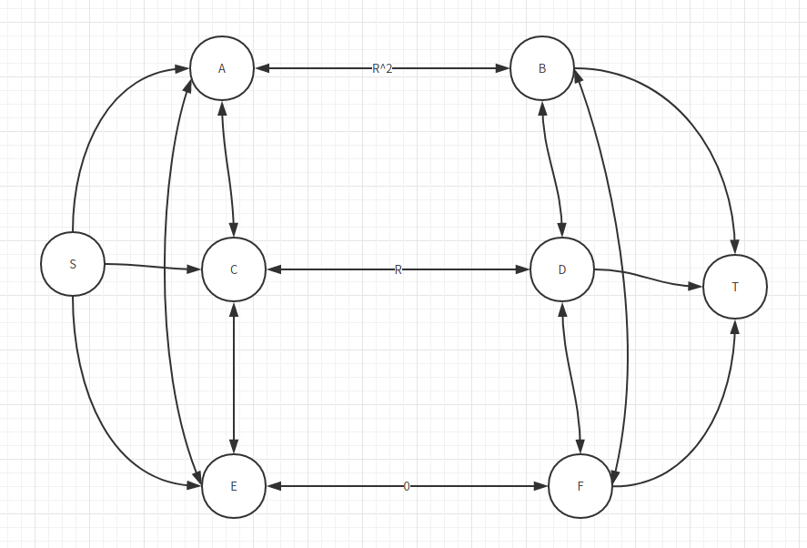

# 1. Homework Five

## 1.1. Explanation of Maximum Flow with weight of real number(实数权重的最大流问题的解释)
如下图所示, 如下为对于图的解释:
1. 了简化图形,图上面的节点有双向的连接和单方向的连接,其中从连接X 和 Y 双向连接是 X 到 Y 和 Y 到 X 的综合
2. 在网络中间, S 是起点, T 是终点
3. 每条边的流量容量按照如下规则
    1. R 为 方程 r^2 + r - 1= 0的解, E 为大于 1的常数
    2. A -> B 为 r^2
    2. C -> D 为 r
    3. E -> F 为 0
    5. 其余的所有的边容量为 E
<p align="center">

</p>

>关于此问题申明, 本问题不考察在具体计算机上面实现, 或者假设在满足表示运算存储实数不会出现精度损失的计算机上面运行.

现在指出最大流运行的过程, 伪代码如下:
```
init round = 0
note the edge A -> B as edge[0]
note the edge C -> D as edge[1]
note the edge E -> F as edge[2]
while(1):
    int index = (round + 2) % 2
    round = round + 1
    find an augment path anti edge[index]'s direction 
    and follow the another two edges' direction with capacity equal to
    r ^ (round + 2)
```
现在说明该算法在理想计算机上面运行用于不会终止:
|   Round       | 0    |  1   |    2   |
| ------------- |:---: | :---:| :---: |
| A -> B        |  r<sup>2</sup> |   0   | r^3|
| C -> D        |  r   |  r^3    | 0|
| E -> F        |  0   |   r^2   |r^4|
下面证明, 对于任意round, 总是可以保证三条边的权重为r^x, r^(x + 1) 和 0(其中 r = round + 1)
**证明**:
1. 如上表所示的, 在round = 1的时候, 三条边权重满足
2. 假设对于round = k的时候满足三条边 E1的权重为 r^x,  E2的权重为 r^(x + 1), E3的权重为0, 那么现在选择正向进过E2 和 E1, 反向经过E3 并且权重为r^(x + 1) 那么之后的参差图三者的权重为 r^(x + 2), 0 和 r^(r + 1), 所以对于 round = k + 1的时候满足
3. 由于所有的augment path 的 flow 求和小于 1 , 所以选择augment path的时候 graph 的其他的边的容量始终充足
4. 综合上述, 可以知道经过任意多步, 三条边的权重依旧满足该数值关系

从上述证明的结论可以知道: 进过任意多的步骤, 依旧可以在找到一条augment path 出来, 所以不会结束 !

该数值的结果求和的极限为1, 上课的时候之所以为2, 是因为初始化的时候首先将Ｅ -> F 的权重初始化为１，　然后找了仅仅进过E -> F 的 augment path,　但是这样证明该问题，　显然是不优雅的．


## 1.2. Other examples
### A 仅仅改变权重
如上面的所叙述的图形结构, 图形权重可以修改为下表所示结果, 其中的m 取值为任意大于 1 的整数
|   Round       | 0    |
| ------------- |:---: |
| A -> B        |  r^(2m) |
| C -> D        |  r^(m)  |
| E -> F        |  0   |

比如对于的m = 5 的取值, 前面三波的取值为:

|   Round       | 0    |  1   |    2   |
| ------------- |:---: | :---:| :---: |
| A -> B        |  r^10 |   0   | r^15|
| C -> D        |  r^5  |  r^15    | 0|
| E -> F        |  0   |   r^5   |r^20|

### Ｂ　修改网络的结构
添加更加多的类似与A -> B 的边, 权重可以任意的设置.  
使用最大流的算法的时候, 首先把哪一种边全部跑完, 然后转化为之前的问题来查找augment path

本质上, 只要可以找到迭代的方程就可以
## Avoid the endless Maximum Flow plight

### Shortest path
由于此处最短路径的定义:从 s 到 t 的边的数目最少, 对于本图形, 最短路显然为3, 而为了保证算法的持续的运行, 需要保证每次找到的路径的长度为7, 所以不可以

### WAP(Widest augment path)
