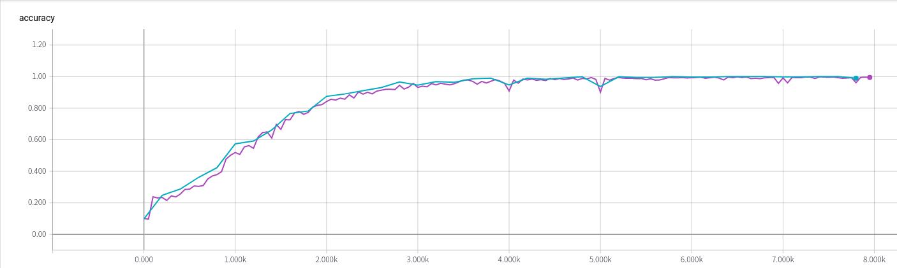
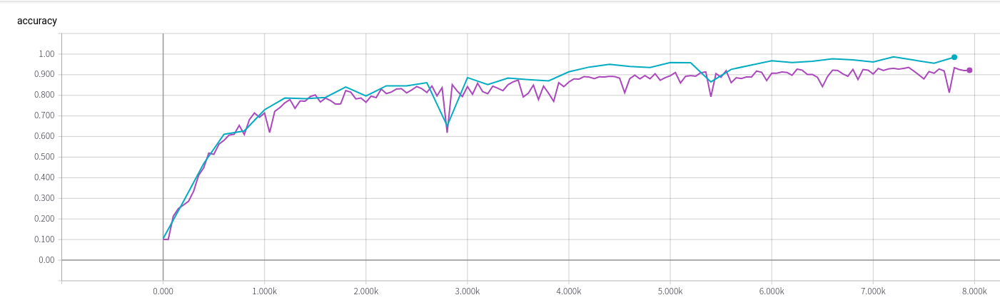
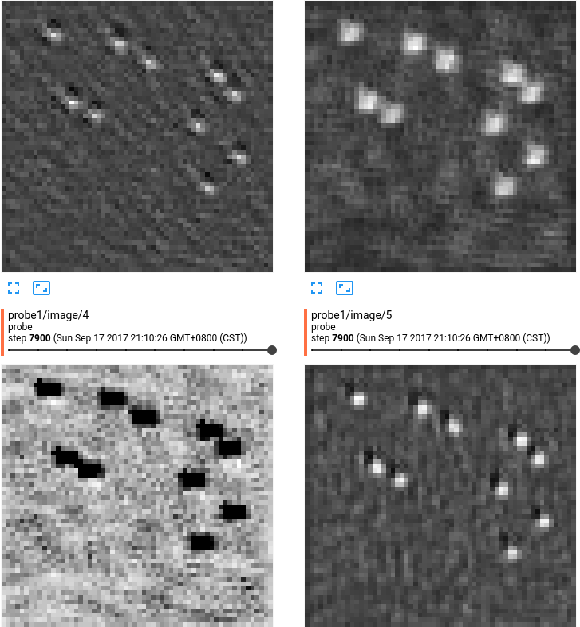
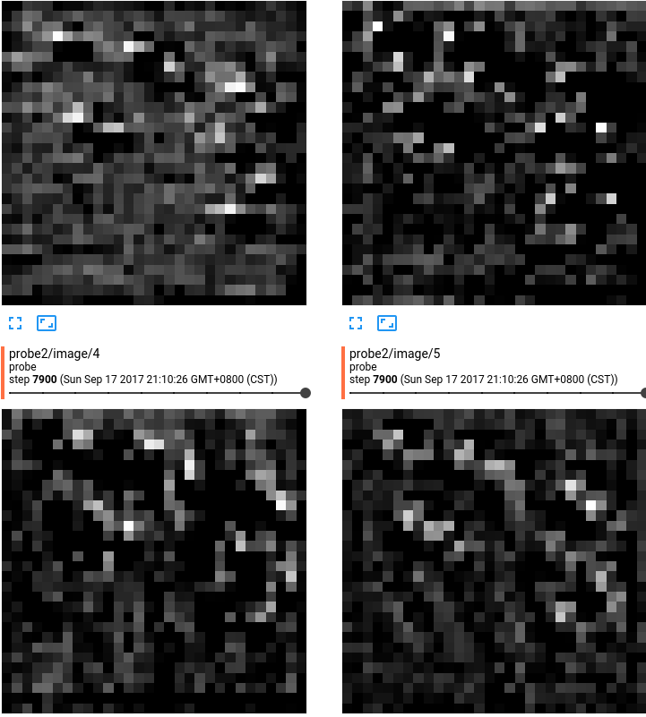
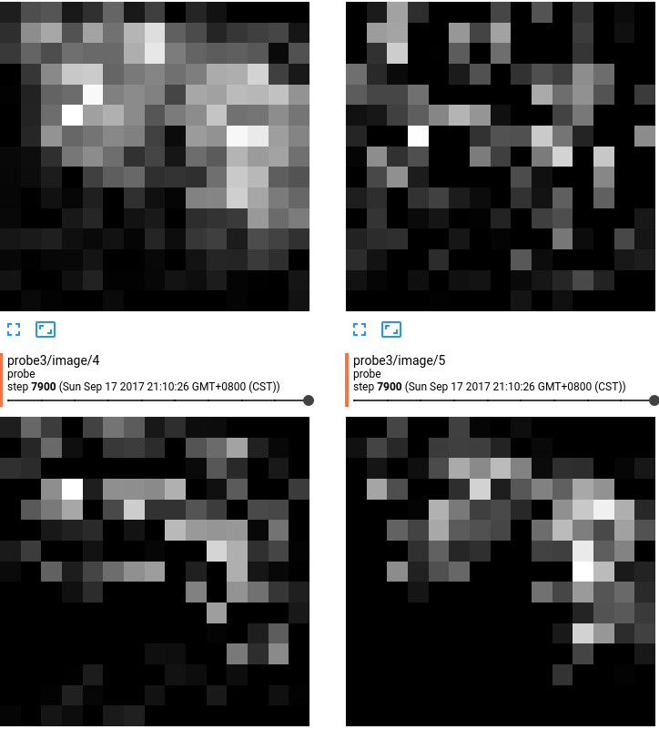
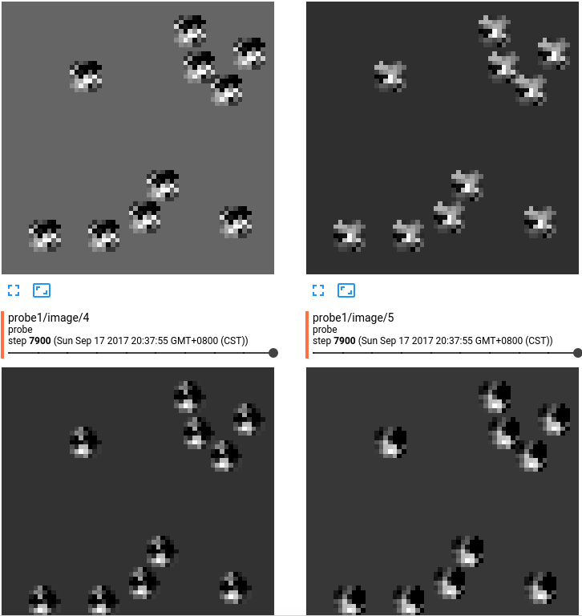
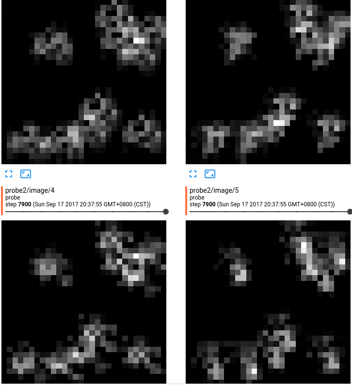
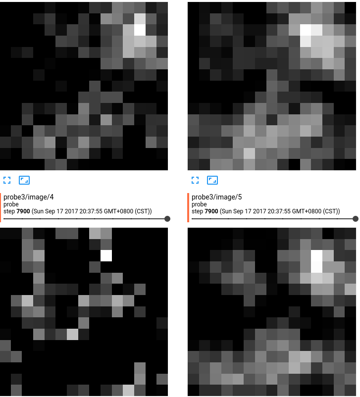
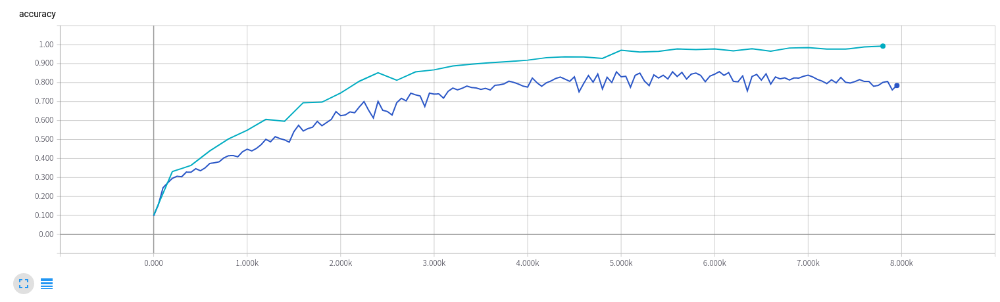
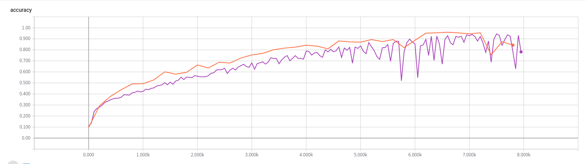

# 9-14 report 

# 进步修改网络结构
从之前两层卷积加上两层全连接(2 + 2), 变成三层加三层(3 + 3), 在原来的数据集合, 精度得到大幅度的提升, 一下是
两者的精度对比图

从图片中间的可以看出来:
1. 精度得到很大的提升
2. 数值的波动大幅度的下降

## 为数据添加噪音
之前的计算数目的训练的集合只有背景的数值全部都是0, 本次实验在原来的数据集合上面添加了高斯噪音的.发现添加噪音之后,训练的难度大大提高.如下图所示:

从上面图值得说明的是:
1. 数据的波动更加明显
2. 无论是训练还是测试集合的精度都是比较第
3. 以上的结果来自于20000的训练的集合

## 探索熟练过程中间卷积层的变化
使用含有噪音 数据量为20000 网络结构为(3 + 3)
第一层:

第二层:

第三层:

使用不含有噪音的 数据量为10000 网结构为(3 + 3)

第一层:

第二层:

第三层:

从上面的结果,目前并没有得出很好结论, 需要使用更好的分析的方法,而不是使用简单的普通的查看的图片的方法.
感性的体会是, 越是后面的层,变化越是明显.各层开始的都是相似,但是最后的时候,每一个层的的差别逐渐增大的.

## 参差网络
搭建了一个小型的参差网络
使用过两个数据集合, 由于没有分析过,目前结果不尽人意.
下图是: 无噪音计算数值

下图是: 有噪音 20000 计数

