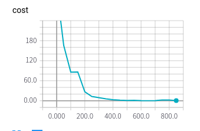

# 9月4日 报告

## A 四种几何形状的监督学习

### 1. 正多边形
数据集合800, 640 训练, 160测试, 多边形大小,角度和中心每一张图片是随机的, 多边形的类型从正三角形到正10边形,每一种各有100张.

正多边形的训练的收敛结果, 如下

在使用过的网络,只要来训练此数据集合, 都是可以得到很好结果,觉得其中的原因是, 为设置图片的大小的为 60 * 60 的, 为了在足够大图像的上面的使用的

### 2. 几何图形的识别
训练集合为10000, 2000测试, 每种数目1000个

训练的效果的如下:

增加一层的cf之后:

1. 由于从正多边形的和本次结果相差很大,所以测试过比较多的参数,得到基本经验是: 网络结构的参数对于的结果相差很大(0.03), 但是weight的方差和初始值的设置影响不是很大.
2. 始终没有办法解决的问题就是波动
3. 增加了cf之后可以看到generalization的变化巨大, 前者test error只有0.8的时候training error就几乎到达1,而后者train test error差值在0.05之内变化

### 3. 线条
线条的数目为(1, 10), 线条长度不同, 变化范围为(14, 20), 线条之间含有角度取值的限制. 图片添加了高斯模糊.样片如下:

使用的网络结构和2中的完全相同的

### 4. 拼图
拼图只有两种变化(可以形成拼图和不可以), 两种各有5000张, 不同拼图的变化体现在所在的矩形的大小和位置,拆分的矩形的朝向,锯齿的深浅变化, 为了放置矩形的交叉和越界,对于矩形的大小和位置都有限制.
制作错误的拼图和正确的拼图方法在于:错误的拼图的凹凸是两个随机数字,而正确的为一个随机数字.可能出现错误拼图其实是正确的,但是概率及其小,可忽视.
正确的两张图样例:

错误的两张图样例:

完全使用2中cnn(2+2)的网络参数,得到的结果如下所示:

1. 曲线的变化首先从随机的0.5, 然后逐渐增加到0.9, 这也是没有经过任何的调试的.
2. 错误的拼图通常凹凸是很大的, 进一步的测试可以修改成为只有一个像素的区别

## B 随机宽度的初步测试
在A2的基础上使用的添加,feature 的dropout, 测试的结果如下.

得到这样的测试结果,首先怀疑的是代码有问题.需要进一步的理解dropout的原理才可以.

> 初步可以分析的部分
1. 虽然不知道为什么, 即使简单的cnn(2 + 2)对于一些简单的集合问题可以实现较好的监督学习

> 没有完成部分  
1. 使用所有的图片全部没有添加噪音
2. 多边形全部都是正多边形
3. 无法解释的为什么的随机宽度出现的结果
4. 没有探索网络内部的原理, 四种几何图形使用的网络结构只有输出的不同, 其余的位置全部相同
5. 不知道learning rate 必须设置为0.0001, 相比通常小很多
6. 理解dropout的原理是什么
7. 目前没有尝试在处理集合图形上面使用简单的网络帮助复杂的网路
8. 不知道为什么单独正多边形的识别效果很好,而且其他的则很差
9. 没有使用混合的几何图形的识别,计算数目仅仅处理为单一形状几何图形数目的计算
10. 为什么增加一层fc 可以如此提高generalization, 增加一层,扩展了网络的能力, 不仅没有导致过拟合, 反而增加了generalization 的能力
11

> personal quesition
1. shape -> color color -> shape 并不知道说明的是什么 ?