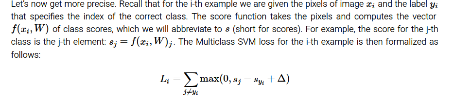
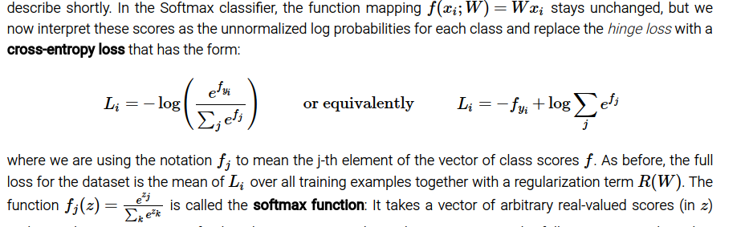

## overall
 __score function__ that maps the raw data to class scores  
 __loss function__ that quantifies the agreement between the predicted scores and the ground truth labels  
We will then cast this as an optimization problem in which we will minimize the loss function with respect to the parameters of the score function.

##  Multiclass Support Vector Machine loss


## softmax loss
说明公式的含义，f 是一个向量，yi 是一个普通下标

softmax 的解释可以从：
1. Information theory view
2. Probabilistic interpretation

## softmax versus SVM
Compared to the Softmax classifier, the SVM is a more local objective, which could be thought of either as a bug or a feature


> Possibly confusing naming conventions. To be precise, the SVM classifier uses the hinge loss, or also sometimes called the max-margin loss. The Softmax classifier uses the cross-entropy loss. The Softmax classifier gets its name from the softmax function, which is used to squash the raw class scores into normalized positive values that sum to one, so that the cross-entropy loss can be applied. In particular, note that technically it doesn’t make sense to talk about the “softmax loss”, since softmax is just the squashing function, but it is a relatively commonly used shorthand.
```
1. 图片使用线性模型？ 如何实现？
2. no free launch 到底在说什么？
```
