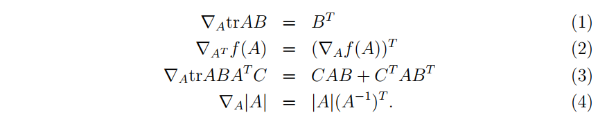

###  locally weighted linear regression (LWR) algorithm

### Newton's method
问题： 为什么求解的是最大值，而不是最大值或者最小值 __p20__

---
non-singular 非奇异矩阵 ，也就是可逆矩阵  
adjoint 伴随矩阵  
intercept 偏移量
 
---
> When we talk about model selection, we’ll also see algorithms for automatically choosing a good set of features.


```
endow
degression
```
