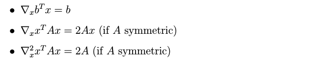
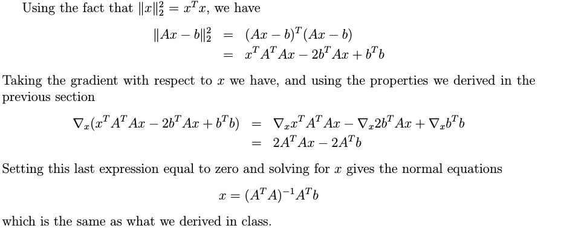

# Matrix Calculus
1. 常用的公式
  > 

2. Least Squares
  > 使用梯度下降来 实现最小二乘法 公式的推导
  > 

3.  Gradients of the Determinant
  >
  >

# Probability Theory
1. 概念
  1. sample space
  2. event space
  3. Probability measure
  4. cumulative distribution function
  5. Probability mass functions(PMF)
  6. Probability density functions(PDF)
  7. joint cumulative distribution function 联合分布
  8. marginal cumulative distribution functions 边缘条件分布
  9. joint probability mass function
  10. marginal probability mass function
  11. joint probability density function
  12. marginal probability density function
2. 常用分布
  > 连续随机变量  
  >
  >离散随机变量  
  >

3. bayes
  > 两个版本  
  >

4. convariance
  1. Cov[X, Y ] = E[(X − E[X])(Y − E[Y ])]
  2. V ar[X + Y ] = V ar[X] + V ar[Y ] +2Cov[X, Y ]
  3. If X and Y are independent, then E[f (X)g(Y )] = E[f (X)]E[g(Y )]
5.  random vector
  1. Covariance matrix: For a given random vector X : Ω → Rn,
   its covariance matrix Σ is the n × n square matrix whose entries are given by Σij = Cov[Xi , Xj]
  2. Σ is positive semidefinite and symmetric

# convex optimization
__see this part in convex optimazation__
__should be finish before 2017 6 1__

# 
